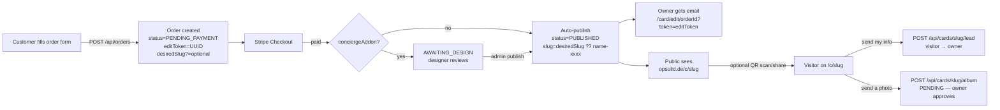

# Digital Card — Ownership & URL Model

> Phase 8 reference. Audience: developers + onboarding. Last updated 2026-04-27.

## Why this document exists

The card system has three different URL flavors (public, edit, preview)
and three different concepts that get conflated by users — and sometimes
by code reviewers — early in their tour:

1. **Who can view the card** (the public).
2. **Who can edit the card** (the owner — magic-link auth via email).
3. **Who can contribute** (visitors, when the owner enables the album —
   their photos require owner approval).

This document is the canonical reference so we don't re-derive it every
time someone asks "wait, can the recipient of a WhatsApp share edit the
card?"

---

## Lifecycle (mermaid)

---

## URL patterns

| URL                                        | Audience  | Auth                          | Mutates? |
|--------------------------------------------|-----------|-------------------------------|----------|
| `opsolid.de/c/<slug>`                      | Public    | None                          | No       |
| `card.opsolid.de/<slug>`                   | Public    | None (host-rewritten in mw)   | No       |
| `go.opsolid.de/<code>`                     | Public    | None (short-link redirect)    | No (logs scan) |
| `opsolid.de/c/<slug>?owner=<editToken>`    | Owner     | editToken validated server-side | No (UI changes — toolbar) |
| `opsolid.de/<locale>/card/edit/<orderId>?token=<editToken>` | Owner | editToken (`requireEditToken`) | Yes (PATCH) |
| `opsolid.de/<locale>/c/preview#d=<base64>` | Anyone with link | None (data is in the URL hash) | No (no DB) |
| `card.opsolid.de/<slug>/contribute`        | Public    | Rate-limited per IP           | Yes — creates PENDING album entry |

### Subdomain wiring

`card.opsolid.de` and `go.opsolid.de` are **already routed in code** (see
`src/middleware.ts` `CARD_HOST` / `SHORTLINK_HOST` host-rewrite rules and
the matching Traefik labels in `docker-compose.yml`). What's missing in
production is just the DNS A-records — once those resolve to the VPS IP,
Traefik will provision Let's Encrypt certs via `mytlschallenge` and the
URLs go live without any code change.

---

## Tokens & secrets

### `editToken` (per-order, opaque, ~128-bit)

* **Generated**: `crypto.randomUUID()` at order creation
  (`src/app/api/orders/route.ts:75`).
* **Stored**: plaintext in `CardOrder.editToken` (single column).
* **Compared**: `requireEditToken()` in `src/lib/auth/edit-token.ts` —
  always constant-time (`timingSafeEqual`), never substring/regex.
* **Distribution**: included in the post-publish email's "edit your card"
  CTA. Never logged. Never embedded in OG images, QR codes, or wallet
  passes.
* **Rotation**: not currently supported. If a customer suspects their link
  was leaked, regenerate manually via the admin endpoint
  (`src/lib/order-actions.ts`) and re-send the confirmation email.

### `decisionToken` (per-album-photo, signed)

* Used by guest photo contribution flow (`/album/[id]` PATCH).
* Embedded in the owner-notification email so they can approve/reject
  with a single tap, no login.

### `eddSession` / Stripe webhook signature

* Validated on every webhook request via Stripe's `constructEvent` —
  **never** trust a webhook payload without running it through that
  helper.

---

## Why public viewers can never edit

Three independent layers:

1. **Route segregation** — the public render lives at `/c/[slug]`, the
   edit UI at `/[locale]/card/edit/[orderId]`. Different files, different
   trees.
2. **Token in URL** — the edit page demands a `?token=` query string. No
   token, no edit page (returns 403 immediately).
3. **API enforcement** — every mutating endpoint (`PATCH /api/card/edit/...`,
   `POST /api/cards/.../album?asOwner=1`, etc.) calls `requireEditToken()`
   before doing any work. Even if a malicious actor reverse-engineered
   the edit page UI, the API would still reject them.

The public link is a **read-only artifact**. The edit link is a
**capability**. They look similar but they are categorically different.

---

## Why visitor contributions need owner approval

Single line: trust boundary. Anyone who can hit `card.opsolid.de/<slug>`
is — by definition — untrusted. We accept their submissions but never
display them publicly until the owner taps "approve" in the dashboard.

* `cardAlbumPhoto.status = PENDING` until decided.
* Public album GET filters on `status = APPROVED` only
  (`src/app/api/cards/[slug]/album/route.ts:111`).
* Owner approval is a single-tap email link OR a button in the edit
  page's "Pending photos" panel.

If an owner wants instant-publish behaviour, that's a future flag on
`CardOrder.cardData.albumAutoApprove` — not currently implemented.

---

## Future work (Phase 8.1+)

* User accounts → multi-card dashboard (currently 1 magic link per card,
  no central dashboard).
* `OrderSlugHistory` model so renaming a slug post-publish keeps old
  links alive via 308 redirects.
* Real `ShortLink` model wired to `go.opsolid.de` for QR scan analytics
  (the route exists; the model isn't populated yet).
* Owner notification email when a guest uploads to the album (currently
  the owner has to check the dashboard).
